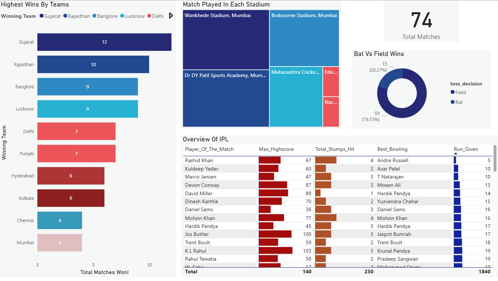

# 🏏 IPL Insights Dashboard | Power BI

## 📌 Overview

An interactive Power BI dashboard built to analyze IPL match data across teams, stadiums, toss decisions, and player performance.
The dashboard helps identify winning patterns, venue usage, toss impact, and standout player statistics for better sports data analysis.

This project showcases my skills in **data cleaning, exploratory data analysis, dashboard development, and insight generation**.

## 🛠 Tech Stack

* **Python (Pandas)** – Data cleaning and preprocessing
* **Power BI Desktop** – Dashboard development and interactive reporting
* **Power Query** – Data transformation and shaping inside Power BI
* **DAX** – Calculated measures, KPIs, and business logic
* **Data Visualization** – Bar chart, treemap, donut chart, KPI card, and tabular performance view

## 📂 Data Source

This project uses a publicly available **IPL dataset** sourced from **Kaggle**.

The dataset contains:

* Match details (**Match ID, Date, Stage, Venue**)
* Team information (**Team1, Team2, Match Winner, Toss Winner**)
* Toss analysis (**Toss Decision**)
* Score details (**First Innings Score, Second Innings Score, Wickets**)
* Player performance (**Player of the Match, Top Scorer, Highscore, Best Bowling, Best Bowling Figure**)

The dataset was cleaned and prepared using **Python** and further transformed in **Power BI / Power Query** before building the dashboard.

## 📈 Features & Goals

### Business Problem

IPL match data contains multiple dimensions such as teams, venues, toss outcomes, and player statistics, which can be difficult to interpret quickly from raw tables.

### Goal of the Dashboard

To create a simple and interactive dashboard that:

* Tracks total IPL matches
* Compares team wins
* Analyzes matches played across stadiums
* Evaluates toss decision impact on winning
* Highlights top player and match performance metrics

## 📊 Dashboard Highlights

* **KPI Card** – Total Matches played
* **Highest Wins by States / Teams (Bar Chart)** – Compares total matches won by top teams
* **Matches Played in Each Stadium (Treemap)** – Shows venue-wise match distribution
* **Bat vs Field Wins (Donut Chart)** – Analyzes toss decision outcomes
* **Overview of IPL (Table Visual)** – Highlights player of the match, top scorer, high score, best bowling, and runs given

## 💡 Key Insights

* **Gujarat** recorded the highest number of wins among the teams shown in the dashboard.
* **Wankhede Stadium, Mumbai** hosted the highest number of matches among the listed venues.
* Teams choosing to **field first** won more matches than teams choosing to bat first.
* The dashboard helps identify important patterns in **team performance, venue usage, and individual player contributions**.

## ✅ Skills Demonstrated

* Data cleaning and transformation
* Exploratory Data Analysis (EDA)
* Sports data analysis
* KPI development and dashboard design
* Presenting insights in a clear and interactive format

## 🎯 Business Impact

This dashboard can help:

* Analyze team and venue performance trends
* Understand toss decision impact on match outcomes
* Highlight player contributions in a structured way
* Support sports analytics and data-driven storytelling

## 📊 Dashboard Preview

